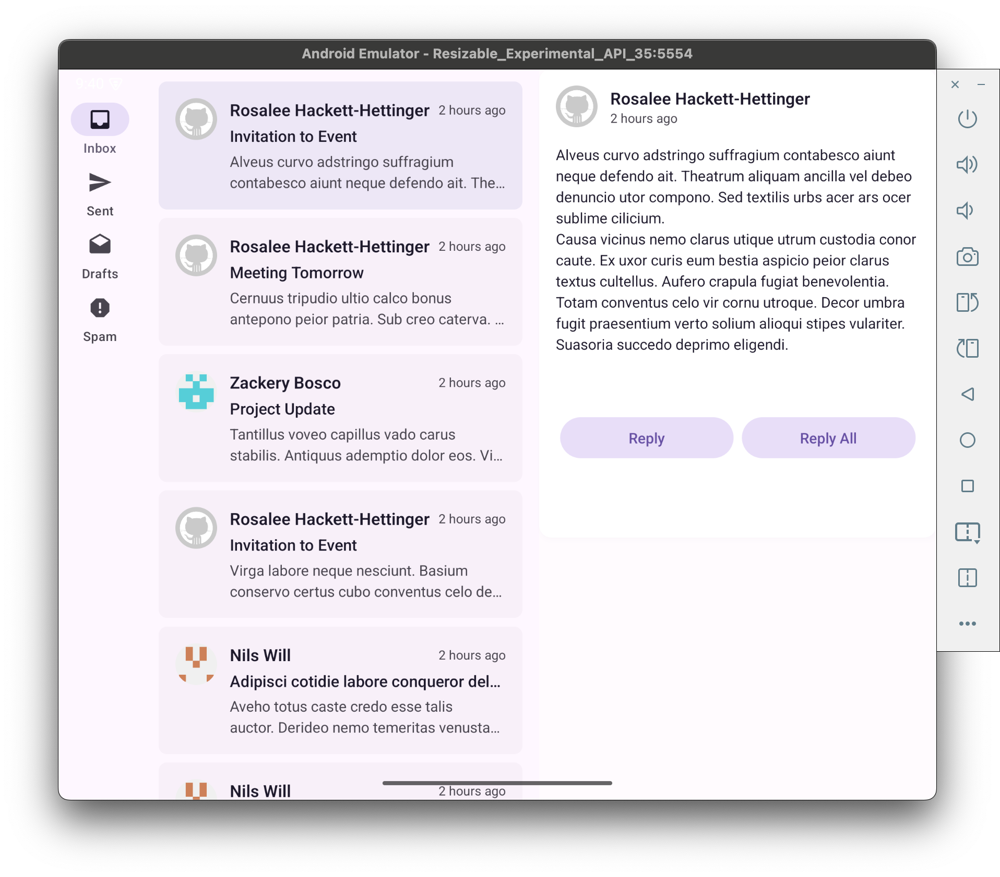
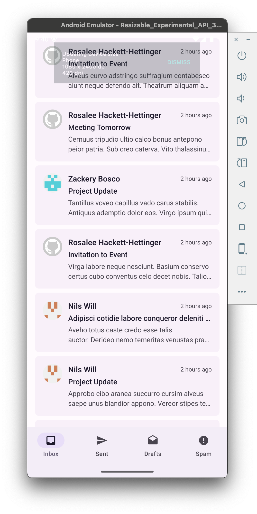

# Adaptive Navigation for React Native

## 🚀 Introduction

**Adaptive Navigation for React Native** aims to bring responsive, platform-specific navigation components to React Native apps. By combining React Native, React Navigation, and Android Jetpack, this project creates a dynamic navigation system that adapts seamlessly to various screen sizes, including foldable devices.

## 🔧 Tech Stack

- **React Native Expo**
- **react-navigation/native**
- **Jetpack Compose**
- **NavigationSuiteScaffold**
- **WindowSizeClass**
- **Adaptive Navigation Suite**

## 🎯 Goals

The primary goal is to implement a dynamic navigation system that adjusts to screen sizes and offers an optimal user experience for both compact and large devices:

- **Compact width/height**: Use a **Navigation Bar** (Bottom Tabs).
- **Larger screens**: Use a **Navigation Rail** for an enhanced experience on tablets, foldables, or large-screen devices.

## 🛠️ Implementation

The project leverages:

1. **Jetpack Compose’s NavigationSuiteScaffold**: A flexible layout component for creating adaptable navigation UIs.
2. **WindowSizeClass**: Detects the screen size and determines whether to show a Navigation Bar or a Navigation Rail.
3. **React Native and React Navigation**: Ensures compatibility with existing React Native projects while providing responsive navigation components.

## 📚 References

[Android Basics Compose Navigation And App Architecture](https://developer.android.com/courses/android-basics-compose/unit-4)

[React Navigation Custom Navigators](https://reactnavigation.org/docs/custom-navigators)

## Demo

